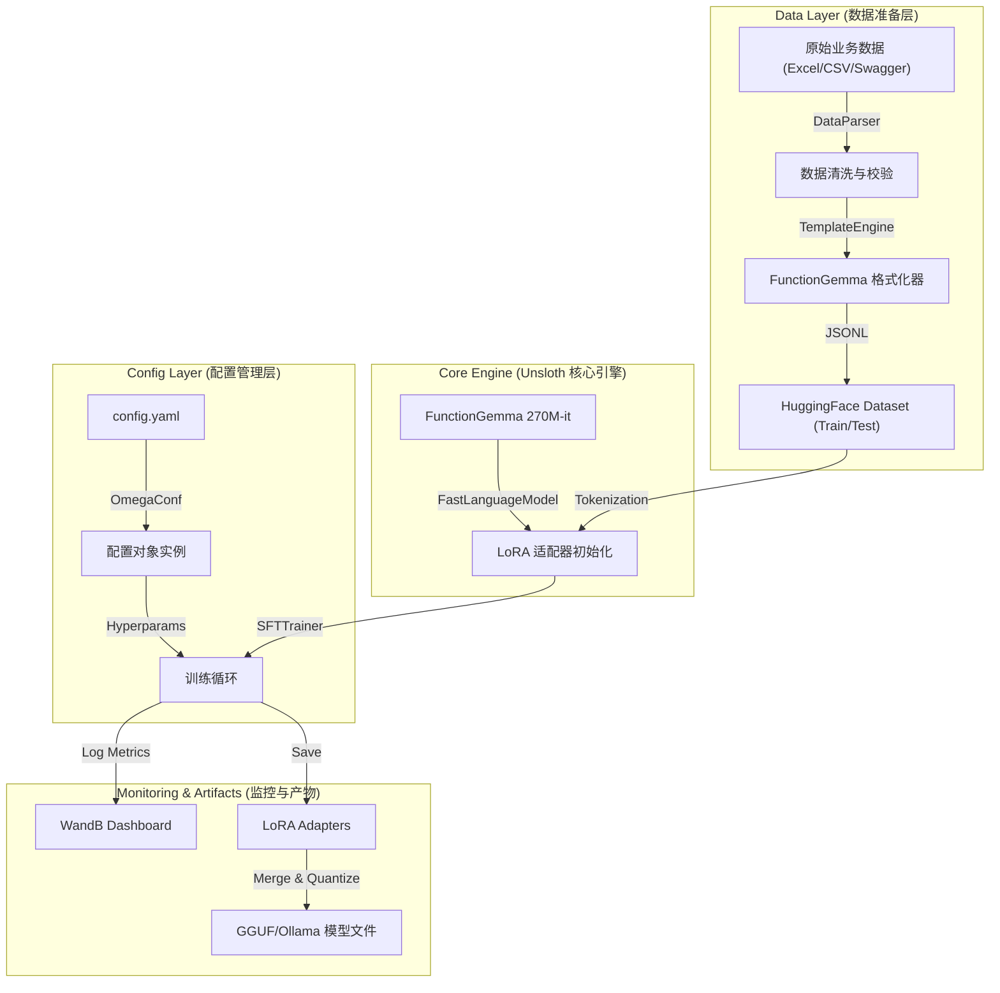

这是一个基于 **Unsloth** 框架，专为 **FunctionGemma 270M** 量身定制的企业级微调项目设计文档。该设计旨在实现从“原始业务数据”到“生产级路由模型”的全流程自动化、配置化与可视化。

------

# 项目名称：FunctionGemma-Unsloth-Enterprise-Tuner

## 1. 项目概述与设计哲学

本项目旨在构建一个**低代码、高可配、可监控**的微调流水线。鉴于 FunctionGemma 270M 的轻量级特性与 Unsloth 的极速优化能力，本架构重点解决以下痛点：

- **数据异构性**：将企业杂乱的 Excel/CSV 业务规则自动转化为 FunctionGemma 严格的 Control Token 格式。
- **实验可复现性**：通过 OmegaConf 实现“配置即代码”，确保每次训练的超参数可追溯。
- **训练透明度**：深度集成 Weights & Biases (WandB)，实时监控 Loss 曲线与显存状态。
- **部署便捷性**：提供一键式云端启动脚本与 GGUF 导出功能。

------

## 2. 系统架构图 (Architecture)

代码段



------

## 2.1 FunctionGemma 270M 技术规格

| 属性 | 值 |
|------|-----|
| **基座架构** | Gemma 3 Decoder-only Transformer |
| **参数量** | 270M (~536MB 权重文件) |
| **上下文窗口** | 32K tokens (输入+输出) |
| **训练数据** | 6T tokens (截至2024年8月) |
| **推理速度** | ~126 tok/s (手机CPU) / ~40 tok/s (RTX 3070) |
| **VRAM需求** | ~848MB |
| **量化部署** | GGUF / TFLite (int8) |
| **HuggingFace** | `google/functiongemma-270m-it` |

### 2.2 特殊控制 Token

FunctionGemma 使用自定义格式而非标准 JSON：

| Token | 用途 |
|-------|------|
| `<start_of_turn>role` / `<end_of_turn>` | 对话轮次标记 (role: user/model/developer) |
| `<start_function_declaration>` / `<end_function_declaration>` | 函数声明 |
| `<start_function_call>` / `<end_function_call>` | 函数调用 |
| `<start_function_response>` / `<end_function_response>` | 函数返回 |
| `<escape>` | 字符串值分隔符 (必须包裹所有字符串值) |

### 2.3 模型推理参数 (Google 官方推荐)

```
top_k = 64
top_p = 0.95
temperature = 1.0
max_new_tokens = 128 (函数调用场景)
```

------

## 3. 项目目录结构设计

采用标准的 ML Engineering 项目结构，模块职责分明。

Plaintext

```
FunctionGemma-Tuner/
├── configs/                    # [配置层] 所有的 YAML 配置文件
│   ├── base_config.yaml        # 全局默认配置
│   ├── experiments/            # 针对不同实验的覆盖配置
│   │   ├── exp_hr_routing.yaml # 例如：HR系统路由实验
│   │   └── exp_crm_agent.yaml  # 例如：CRM系统Agent实验
│   └── templates/              # 对话模板配置
├── data/                       # [数据层]
│   ├── raw/                    # 原始 Excel/CSV 文件
│   ├── processed/              # 转换后的 JSONL 文件
│   └── templates/              # 提示词模板 (Jinja2)
├── notebooks/                  # [交互层] Jupyter Notebooks
│   ├── 01_data_preview.ipynb   # 数据转换预览与校验
│   ├── 02_quick_finetune.ipynb # 快速验证/Debug 流程
│   └── 03_inference_test.ipynb # 模型加载与推理测试
├── outputs/                    # [产出层] 训练日志与模型权重
├── scripts/                    # [执行层] Shell 脚本
│   ├── setup_env.sh            # 环境安装脚本
│   └── run_cloud_train.sh      # 云主机一键启动脚本
├── src/                        # [核心代码层]
│   ├── __init__.py
│   ├── data_engine/            # 数据处理模块
│   │   ├── converter.py        # Excel -> JSONL 核心逻辑
│   │   └── formatter.py        # FunctionGemma 特殊 Token 处理
│   ├── training/               # 训练逻辑模块
│   │   ├── trainer.py          # Unsloth SFTTrainer 封装
│   │   └── callbacks.py        # WandB 回调与自定义 Checkpoint
│   └── utils/                  # 工具类
│       ├── config_loader.py    # OmegaConf 加载器
│       └── export.py           # 模型合并与 GGUF 导出
├── main.py                     # 程序主入口 (CLI)
├── requirements.txt            # Python 依赖
└── README.md                   # 项目文档
```

------

## 4. 核心模块详细设计

### 4.1. 配置管理模块 (`configs/` & `src/utils/config_loader.py`)

使用 **OmegaConf** 库，支持层级配置和命令行参数覆盖。

- **设计要点**：
  - **Structure**：将配置分为 `model` (模型路径、最大长度), `lora` (rank, alpha, target_modules), `data` (输入路径, 分割比例), `training` (lr, batch_size, epochs), `logging` (wandb_project) 五大块。
  - **FunctionGemma 特性**：在 `model` 配置中，预设 `chat_template` 字段，确保 Unsloth 加载正确的 ChatML 或 Gemma 格式。

### 4.2. 数据引擎模块 (`src/data_engine/`)

这是连接业务与算法的桥梁，负责将二维表格转换为高维的对话张量。

- **`converter.py` (Excel 转换器)**：

  - **输入**：读取 Excel 文件，识别 `User Prompt`, `Tool Name`, `Tool Args` 列。
  - **校验**：检查 `Tool Args` 是否为合法的 JSON 字符串，检查 `Tool Name` 是否为空。
  - **负采样增强 (可选)**：设计逻辑，随机插入不相关的 Tool Schema 作为干扰项（Distractors），增强模型鲁棒性。

- **`formatter.py` (Token 注入器)**：

  - **核心逻辑**：严格封装 FunctionGemma 的特殊 Token，所有字符串值必须用 `<escape>` 包裹。

  - **完整模板结构**：

    **Step 1: Developer Turn (函数声明)**
    ```
    <start_of_turn>developer
    You are a model that can do function calling with the following functions
    <start_function_declaration>declaration:FUNCTION_NAME{description:<escape>函数描述<escape>,parameters:{properties:{param_name:{description:<escape>参数描述<escape>,type:string,required:true}}}}<end_function_declaration>
    <end_of_turn>
    ```

    **Step 2: User Turn**
    ```
    <start_of_turn>user
    {user_query}<end_of_turn>
    ```

    **Step 3: Model Turn (函数调用)**
    ```
    <start_of_turn>model
    <start_function_call>call:FUNCTION_NAME{param_name:<escape>param_value<escape>}<end_function_call><end_of_turn>
    ```

    **Step 4: Function Response Turn (可选，用于多轮对话)**
    ```
    <start_of_turn>user
    <start_function_response>response:FUNCTION_NAME{result:<escape>返回值<escape>}<end_function_response><end_of_turn>
    ```

  - **关键点**：
    - 所有字符串值必须用 `<escape>` 包裹，例如 `<escape>value<escape>`
    - Developer 角色必须包含激活语句: `You are a model that can do function calling with the following functions`
    - 函数调用格式为 `call:FUNCTION_NAME{param:<escape>value<escape>}`
    - 数值类型不需要 `<escape>` 包裹

  - **输出**：生成符合 HuggingFace Dataset 标准的 `text` 字段。

### 4.2.1 训练数据格式 (JSONL)

每行一个训练样本：

```json
{"user_content": "把背景改成红色", "tool_name": "change_background_color", "tool_arguments": "{\"color\": \"red\"}"}
{"user_content": "查询北京天气", "tool_name": "get_weather", "tool_arguments": "{\"location\": \"Beijing\"}"}
```

**数据量建议**：
- 最小可行: 每函数 50-100 样本
- 生产推荐: 每函数 200-500 样本
- 实测参考: 284样本/3函数 → 准确率从 58% 提升至 85%

### 4.3. 训练引擎模块 (`src/training/`)

基于 Unsloth 的 `FastLanguageModel` 进行二次封装。

- **`trainer.py`**：
  - **初始化**：自动检测 GPU 架构（Ampere/Hopper），自动配置 `bfloat16` 或 `float16`。
  - **LoRA 挂载**：根据 OmegaConf 读取 `target_modules`。对于 FunctionGemma，默认推荐覆盖 `["q_proj", "k_proj", "v_proj", "o_proj", "gate_proj", "up_proj", "down_proj"]`。
  - **训练循环**：实例化 `trl.SFTTrainer`。
  - **内存优化**：集成 `unsloth.is_bfloat16_supported()` 判断，自动开启 `gradient_checkpointing`。
- **`callbacks.py`**：
  - 集成 `WandbCallback`，记录 Loss、Learning Rate。
  - 实现 `SampleGenerationCallback`：在每个 Epoch 结束时，随机抽取一条验证集数据进行推理，打印结果到控制台或 WandB，直观评估模型是否“学会了路由”。

### 4.4. 交互式 Notebooks (`notebooks/`)

为开发者提供“所见即所得”的调试环境。

1. **`01_data_preview.ipynb`**：
   - 加载 Excel。
   - 展示转换后的 Prompt 样式（高亮显示特殊 Token）。
   - 统计 Token 长度分布，帮助设置 `max_seq_length`。
2. **`02_quick_finetune.ipynb`**：
   - 最小化代码实现。
   - 直接在 Notebook 单元格中定义 Config。
   - 运行 60 步（Steps）训练，验证 Loss 是否下降。
3. **`03_inference_test.ipynb`**：
   - 加载微调后的 Adapter。
   - 使用 `FastLanguageModel.for_inference(model)` 开启原生 2 倍速推理。
   - 输入新的自然语言指令，验证输出的 JSON 结构是否合法。

------

## 5. 云端执行脚本设计 (`scripts/`)

针对云主机（如 AWS EC2, Google Cloud VM, RunPod, AutoDL）的自动化脚本。

### 5.1. `setup_env.sh` (环境初始化)

由于 Unsloth 对 PyTorch 和 CUDA 版本敏感，此脚本至关重要。

- **逻辑**：
  1. 检查 CUDA 版本 (`nvcc --version`)。
  2. 创建 Conda 环境 `function_gemma_env`。
  3. 安装 PyTorch (根据 CUDA 版本自动选择 index-url)。
  4. 安装 `unsloth[colab-new]` 或指定版本。
  5. 安装 `wandb`, `omegaconf`, `pandas`, `openpyxl`, `trl`。

### 5.2. `run_cloud_train.sh` (一键训练)

- **功能**：后台运行训练任务，防止 SSH 断开导致中断。

- **逻辑**：

  Bash

  ```
  #!/bin/bash
  # 激活环境
  source activate function_gemma_env
  
  # 获取实验名称
  EXP_NAME=$1
  if [ -z "$EXP_NAME" ]; then EXP_NAME="default_run"; fi
  
  echo "Starting training for experiment: $EXP_NAME"
  
  # 运行主程序，使用 nohup 后台运行，日志重定向
  nohup python main.py \
      --config-name base_config \
      experiments=$EXP_NAME \
      > outputs/logs/${EXP_NAME}_$(date +%s).log 2>&1 &
  
  echo "Training started. Check logs in outputs/logs/"
  ```

------

## 6. 技术栈选型总结

| **模块**     | **选型**                           | **理由**                                                 |
| ------------ | ---------------------------------- | -------------------------------------------------------- |
| **基座模型** | `google/functiongemma-270m-it`     | HuggingFace 官方源，专为函数调用优化，体积小，推理快。   |
| **训练框架** | **Unsloth**                        | 显存占用减少 60%，训练速度提升 2 倍，支持 LoRA/QLoRA。   |
| **微调库**   | **HuggingFace TRL**                | 工业界标准的 SFTTrainer，生态兼容性好。                  |
| **配置管理** | **OmegaConf**                      | 支持 YAML，类型安全，方便参数合并。                      |
| **数据处理** | **Pandas**                         | 强大的表格数据处理能力。                                 |
| **监控**     | **WandB** (Weights & Biases)       | 实时可视化，易于分享实验结果。                           |
| **模型导出** | **GGUF** (via Unsloth)             | 方便后续接入 Ollama 或 Llama.cpp 进行 CPU/GPU 混合推理。 |
| **量化部署** | **llama.cpp / LM Studio / TFLite** | 支持 int8 量化，可部署到手机、边缘设备。                 |

------

## 7. 下一步行动建议

1. **初始化仓库**：按照目录结构创建 Git 仓库。
2. **编写数据转换器**：这是最优先的任务，先打通 Excel 到 JSONL 的路径。
3. **调试 Notebook**：在 Colab 或本地 GPU 上跑通 `02_quick_finetune.ipynb`，确保 Unsloth 环境配置正确。
4. **封装 Trainer**：将 Notebook 中的逻辑迁移到 `src/training/trainer.py` 中。
5. **云端测试**：租用一台 T4 或 L4 显卡的云主机，运行 `setup_env.sh` 验证环境一致性。